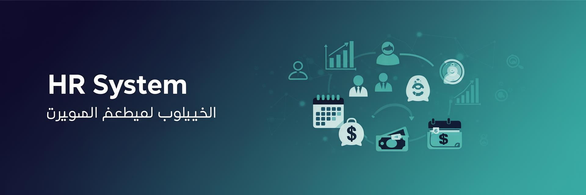

<div align="center">



# 🏢 نظام الموارد البشرية | HR Management System

### منصة SaaS متكاملة لإدارة الموارد البشرية مصممة خصيصاً لمنطقة الشرق الأوسط وشمال أفريقيا

**A comprehensive, production-grade HR Management SaaS platform designed for the MENA region**

[](https://react.dev)
[](https://www.typescriptlang.org)
[](https://tailwindcss.com)
[](https://supabase.com)
[](https://vitejs.dev)
[](LICENSE)

[🌐 Live Demo](https://lovable.dev/projects/REPLACE_WITH_PROJECT_ID) · [📖 Documentation](#-documentation) · [🐛 Report Bug](https://github.com/REPLACE/issues) · [✨ Request Feature](https://github.com/REPLACE/issues)

</div>

---

## 📋 Table of Contents

- [Overview](#-overview)
- [Key Features](#-key-features)
- [Tech Stack](#-tech-stack)
- [Architecture](#-architecture)
- [Getting Started](#-getting-started)
- [Project Structure](#-project-structure)
- [Screenshots](#-screenshots)
- [Modules](#-modules)
- [Security](#-security)
- [Contributing](#-contributing)
- [License](#-license)

---

## 🌟 Overview

**HR System** is a fully bilingual (Arabic/English) HR Management platform built to address the gap in the MENA market for modern, open-source HR solutions. Unlike global HR tools (BambooHR, Gusto, Personio), this platform is designed **Arabic-first** with native **RTL support**, regional labor law compliance, and full localization.

### Why This Project?

| Problem | Our Solution |
|---------|-------------|
| Most HR systems lack Arabic support | Native bilingual architecture (AR/EN) |
| No RTL-first HR platforms | Built from ground up with RTL support |
| Regional compliance gaps | GOSI calculations, ID/Iqama tracking |
| Expensive enterprise solutions | Open-source with tiered pricing |
| Data isolation concerns | Row-Level Security (RLS) per tenant |

---

## ✨ Key Features

### 🌍 Localization & Accessibility
- **Full Bilingual Support** — Arabic & English with instant language switching
- **RTL/LTR Native** — Seamless right-to-left and left-to-right layout switching
- **Bilingual Database** — All entities support `name_ar`/`name_en` fields

### 👥 Employee Management
- Complete employee profiles with personal & professional data
- Contract management (Full-time, Part-time, Contract, Temporary)
- Document tracking with expiry notifications (ID, Iqama, Contracts)
- Multi-branch employee assignment
- Employee self-service portal

### ⏰ Attendance & Time Tracking
- Daily check-in/check-out tracking
- Attendance status management (Present, Absent, Late, Excused)
- Monthly attendance reports & analytics
- Employee-facing attendance view

### 🏖️ Leave Management
- **6 Leave Types**: Annual, Sick, Emergency, Unpaid, Maternity, Paternity
- Leave balance tracking per employee per year
- Multi-level approval workflows
- Leave calendar with team view

### 💰 Payroll Processing
- Salary calculation with configurable components:
  - Basic Salary
  - Housing Allowance
  - Transport Allowance
  - Other Allowances
  - Overtime
- Social insurance deductions (GOSI-compliant)
- Payroll statuses: Draft → Processing → Completed → Paid
- Monthly payslip generation

### 💳 Loans & Advances
- Loan request and approval workflow
- Installment tracking with monthly auto-deductions
- Remaining balance calculation
- Status lifecycle: Pending → Approved → Active → Paid

### 📢 Recruitment
- Job posting management with department linkage
- Application tracking
- Posting status management (Open, Closed, On Hold)

### 📚 Training & Development
- Course creation and management
- Employee enrollment tracking
- Completion status and scoring
- Maximum participant limits

### 📊 Performance Evaluations
- Evaluation cycle management
- Self-assessment capabilities
- Manager scoring and comments
- Cycle statuses: Draft → Active → Completed

### 🔔 Notifications
- Contract expiry alerts
- ID/Iqama expiry notifications
- System-wide notification center

### 🔍 Smart Search (Ctrl+K)
- Global command palette search
- Cross-module search (Employees, Departments, Actions)
- Keyboard-driven navigation

---

## 🛠️ Tech Stack

| Layer | Technology | Purpose |
|-------|-----------|---------|
| **Frontend** | React 18 + TypeScript | UI Framework |
| **Build Tool** | Vite 5 | Fast HMR & bundling |
| **Styling** | Tailwind CSS + shadcn/ui | Design system |
| **State Management** | TanStack Query v5 | Server state & caching |
| **Routing** | React Router v6 | Client-side routing |
| **Backend** | Supabase | Auth, Database, Edge Functions |
| **Database** | PostgreSQL | Primary data store |
| **Payments** | Stripe | Subscription management |
| **Charts** | Recharts | Data visualization |
| **Forms** | React Hook Form + Zod | Form handling & validation |
| **Animations** | Framer Motion | UI animations |

---

## 🏗️ Architecture

```
┌─────────────────────────────────────────────────────┐
│                   Frontend (React)                   │
│  ┌───────────┐ ┌──────────┐ ┌────────────────────┐  │
│  │  Pages    │ │Components│ │   Hooks & Context   │  │
│  │  (Views)  │ │  (UI)    │ │  (State & Logic)    │  │
│  └─────┬─────┘ └────┬─────┘ └─────────┬──────────┘  │
│        └─────────────┼─────────────────┘             │
│                      │                               │
│              ┌───────▼───────┐                       │
│              │ Supabase SDK  │                       │
│              └───────┬───────┘                       │
└──────────────────────┼──────────────────────────────┘
                       │
┌──────────────────────┼──────────────────────────────┐
│              Supabase Backend                        │
│  ┌───────────┐ ┌─────▼─────┐ ┌────────────────┐    │
│  │   Auth    │ │ PostgreSQL │ │ Edge Functions  │    │
│  │  (JWT)    │ │  + RLS     │ │  (Serverless)   │    │
│  └───────────┘ └───────────┘ └────────────────┘    │
│  ┌───────────┐ ┌───────────┐ ┌────────────────┐    │
│  │  Storage  │ │ Realtime  │ │    Stripe       │    │
│  │  (Files)  │ │ (WebSocket)│ │  (Payments)     │    │
│  └───────────┘ └───────────┘ └────────────────┘    │
└─────────────────────────────────────────────────────┘
```

### Multi-Tenant Data Flow
```
User Request → Auth (JWT) → RLS Policy Check → company_id Filter → Data
```

---

## 🚀 Getting Started

### Prerequisites

- **Node.js** ≥ 18.0 ([Install with nvm](https://github.com/nvm-sh/nvm))
- **npm** or **bun** package manager
- **Supabase** account (for backend)

### Installation

```bash
# 1. Clone the repository
git clone https://github.com/REPLACE_WITH_USERNAME/hr-system.git

# 2. Navigate to the project directory
cd hr-system

# 3. Install dependencies
npm install

# 4. Set up environment variables
cp .env.example .env
# Edit .env with your Supabase credentials:
# VITE_SUPABASE_URL=your_supabase_url
# VITE_SUPABASE_PUBLISHABLE_KEY=your_anon_key

# 5. Start the development server
npm run dev
```

The app will be available at `http://localhost:5173`

### Quick Start with Lovable

Alternatively, you can use [Lovable](https://lovable.dev) for instant deployment:

1. Visit the [Lovable Project](https://lovable.dev/projects/REPLACE_WITH_PROJECT_ID)
2. Start prompting to make changes
3. Changes are automatically committed and deployed

---

## 📁 Project Structure

```
src/
├── components/
│   ├── admin/          # Super admin panel components
│   ├── layout/         # App layout (Sidebar, TopBar, etc.)
│   └── ui/             # Reusable UI components (shadcn/ui)
├── hooks/
│   ├── useAuth.tsx     # Authentication hook
│   ├── useCompany.tsx  # Company/tenant context
│   ├── useUserRole.tsx # Role-based access
│   └── usePagination.tsx
├── i18n/
│   ├── LanguageContext.tsx  # Language provider
│   └── translations.ts     # AR/EN translations
├── integrations/
│   └── supabase/       # Auto-generated Supabase client & types
├── pages/
│   ├── admin/          # Super admin pages
│   ├── employee/       # Employee self-service pages
│   ├── Dashboard.tsx   # Main dashboard
│   ├── Employees.tsx   # Employee management
│   ├── Attendance.tsx  # Attendance tracking
│   ├── Leaves.tsx      # Leave management
│   ├── Payroll.tsx     # Payroll processing
│   ├── Recruitment.tsx # Job postings
│   ├── Training.tsx    # Training courses
│   ├── Performance.tsx # Evaluations
│   └── ...
└── supabase/
    └── functions/      # Edge functions (serverless)
```

---

## 📸 Screenshots

> 🖼️ *Screenshots coming soon — contributions welcome!*

| Feature | Description |
|---------|-------------|
| **Dashboard** | Overview with KPIs, charts, and recent activities |
| **Employee List** | Searchable, filterable employee directory |
| **Payroll** | Monthly salary processing with deductions |
| **Leave Calendar** | Visual leave tracking with approval status |
| **Command Palette** | Quick search with Ctrl+K |

---

## 📦 Modules

### Core Modules

| Module | Status | Description |
|--------|--------|-------------|
| 👥 Employees | ✅ Complete | Full CRUD with profiles & documents |
| ⏰ Attendance | ✅ Complete | Check-in/out with daily tracking |
| 🏖️ Leaves | ✅ Complete | 6 types with balance & approval |
| 💰 Payroll | ✅ Complete | Salary calc with allowances |
| 💳 Loans | ✅ Complete | Installment tracking |
| 📢 Recruitment | ✅ Complete | Job postings & applications |
| 📚 Training | ✅ Complete | Courses & enrollments |
| 📊 Performance | ✅ Complete | Evaluation cycles |
| 🏢 Departments | ✅ Complete | Department management |
| 🏗️ Branches | ✅ Complete | Multi-branch support |

### Platform Features

| Feature | Status | Description |
|---------|--------|-------------|
| 🔐 Authentication | ✅ Complete | Email/password with verification |
| 👑 RBAC | ✅ Complete | Admin, HR Manager, Manager, Employee |
| 🌍 i18n (AR/EN) | ✅ Complete | Full bilingual support |
| 🔄 RTL Support | ✅ Complete | Native RTL layout |
| 💳 Subscriptions | ✅ Complete | Stripe (Basic/Pro/Enterprise) |
| 🔔 Notifications | ✅ Complete | Expiry alerts & system notifications |
| 🔍 Global Search | ✅ Complete | Ctrl+K command palette |
| 📱 Responsive | ✅ Complete | Mobile-first design |

---

## 🔒 Security

### Authentication & Authorization
- **JWT-based authentication** via Supabase Auth
- **Role-Based Access Control (RBAC)** with 4 roles:
  - `admin` — Full company access
  - `hr_manager` — HR operations
  - `manager` — Team management
  - `employee` — Self-service only

### Data Isolation
- **Row-Level Security (RLS)** on all tables
- Tenant isolation via `company_id` filtering
- Security-definer functions to prevent recursive RLS checks

### Best Practices
- No client-side role checking for authorization
- Separate `user_roles` table (not on profiles)
- Server-side validation for all sensitive operations

---

## 🤝 Contributing

Contributions are welcome! Please follow these steps:

1. **Fork** the repository
2. **Create** a feature branch (`git checkout -b feature/amazing-feature`)
3. **Commit** your changes (`git commit -m 'Add amazing feature'`)
4. **Push** to the branch (`git push origin feature/amazing-feature`)
5. **Open** a Pull Request

### Development Guidelines
- Follow TypeScript strict mode
- Use shadcn/ui components with Tailwind semantic tokens
- Add translations for both Arabic and English
- Write RLS policies for new tables
- Test RTL layout for all UI changes

---

## 📄 License

This project is licensed under the **MIT License** — see the [LICENSE](LICENSE) file for details.

---

<div align="center">

**Built with ❤️ for the MENA region**

[⬆ Back to Top](#-نظام-الموارد-البشرية--hr-management-system)

</div>
